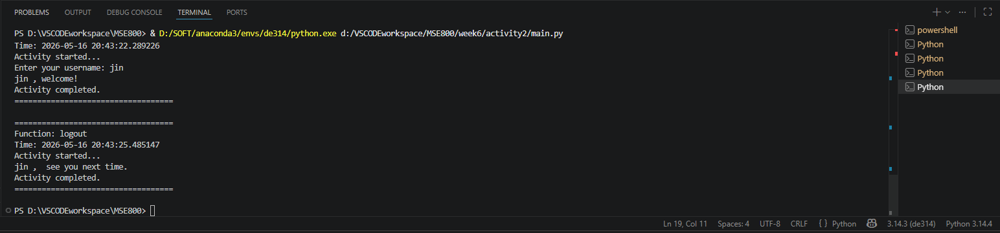

##  project structure

├── main.py
├── ZooUser.py
├── ZooUserDecorators.py
└── README.md

##  How the Decorator is Implemented 
We apply the decorator above the target function using the @ syntax.
When the decorated function is called, it is intercepted and redirected to execute the logic inside the decorator.
The decorator executes the original decorated function via the code result = func(*args, **kwargs).

## Program Running Screenshot
