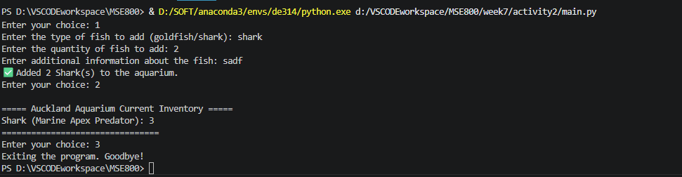

# Auckland Aquarium Management System

A simple fish inventory management system for an aquarium in Auckland, implementing both the Singleton and Factory design patterns in Python.

## 🏛️ Design Patterns Used

1. **Singleton Pattern (`aquarium.py`)**
   * **Purpose:** Ensures only **one global instance** of the `Aquarium` class manages the inventory database.
   * **Usage:** Initializes the storage dictionary (`_inventory`) exactly once to act as a single source of truth, avoiding duplicate tracking or memory leaks.

2. **Factory Pattern (`fish.py`)**
   * **Purpose:** Decouples core subsystem management from concrete fish instantiation.
   * **Usage:** The `FishFactory` class takes a dynamic string input (e.g., 'shark', 'goldfish') and safely instantiates the corresponding fish with its predetermined environmental classification category.

---

## 🐟 Supported Categories

The system automatically manages 5 core species along with their display classifications:
* **Goldfish** -> Cold Freshwater
* **Shark** -> Marine Apex Predator
* **Angelfish** -> Tropical Freshwater
* **Tuna** -> Pelagic Ocean Fish
* **Salmon** -> Anadromous Fish

---

##  How to Run the Project

### 1. Repository File Structure
Ensure your project folder contains the following three script components:
* `main.py` (User interaction menus)
* `aquarium.py` (Singleton inventory coordinator)
* `fish.py` (Stateless generation factory and subclasses)

### 2. Execution Command
Launch the simulation console via your local terminal terminal:
 
```bash
python main.py
 ```

### 3. Console Execution Example

 
