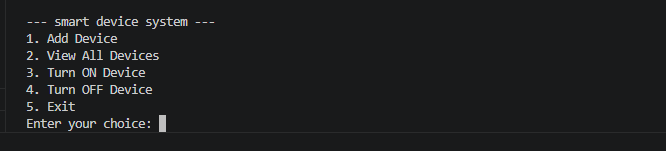
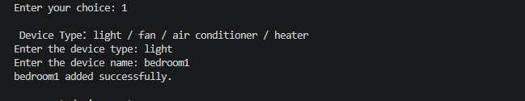
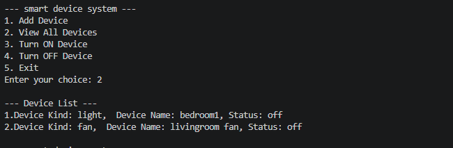
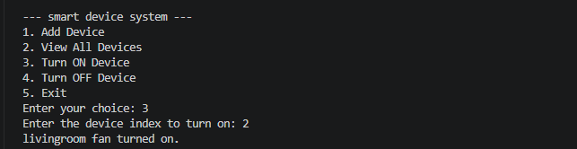
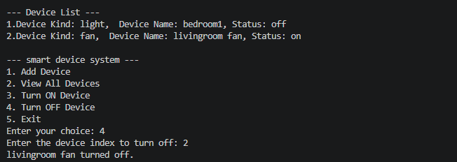

# Smart Device IoT System

A Python-based lightweight Internet of Things (IoT) management system using Object-Oriented Programming (OOP) and Design Patterns. It dynamically manages various office devices including Lights, Fans, Air Conditioners, and Heaters.

📅 **Due Date:** 31 May 2026, 8:00 AM  
🏫 **Course Activity:** Week 7 - Activity 3

---

## 📌 Project Overview
This system provides a unified terminal interface to manage smart appliances in an office environment. Users can dynamically add new devices via raw console inputs, monitor current specifications, and toggle power status remotely through a central logic engine.

---

## 🛠️ OOP Concepts Implemented

1. **Inheritance:** Concrete device subclasses (`Light`, `Fan`, `AirConditioner`, `Heater`) inherit general configurations and behaviors from the generalized abstract parent class `SmartDevice`.
2. **Encapsulation:** Device properties (such as `name`, `kind`, and `status`) are managed internally within object scopes and safely manipulated via public interface workflows.
3. **Polymorphism:** Methods like `turn_on()` are dynamically resolved depending on the specific subclass type (e.g., calling `turn_on()` on a `Light` object also automatically sets its brightness value to 100).

---

## 📐 Design Patterns Used

### 1. Factory Pattern
- **Module:** `device_factory.py`
- **Logic:** Decouples client workflows from exact hardware instantiation. The `DeviceFactory` analyzes text string arguments (`"light"`, `"heater"`) to safely dynamically output the proper device object instance.

### 2. Singleton Pattern
- **Module:** `configuration_management.py`
- **Logic:** Enforces a unified, singular source of truth for configuration structures. By configuring the internal `__new__` dunder constructor, `ConfigurationManagement` yields the exact same memory instance across consecutive loop initialization pipelines.

---

## ScreenShots

### 1. Main Menu 

 

### 2. Add Device

 

### 3. Device List 

 

### 4. Device Turn On

 

### 4. Device Turn Off

 
