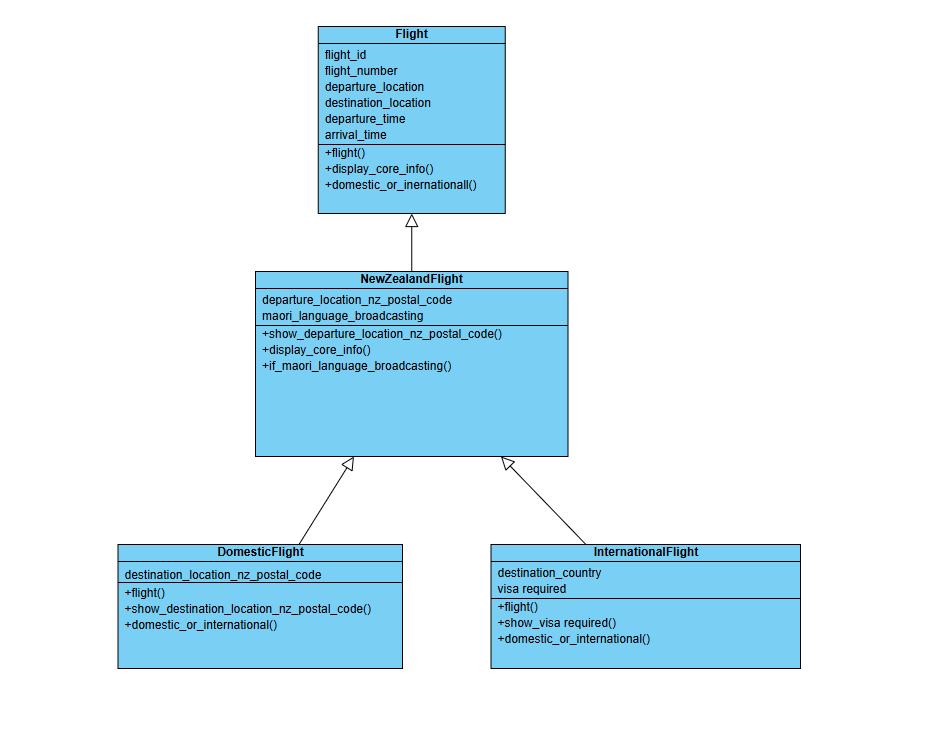
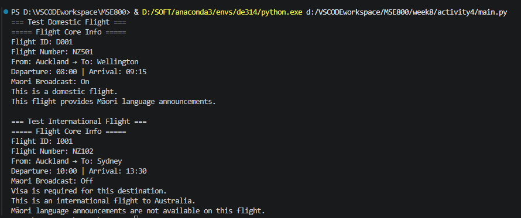

## File Structure
```
AirNZ_Flight/
├─ Flight.py
├─ NewZealandFlight.py
├─ DomesticFlight.py
├─ InternationalFlight.py
├─ main.py
└─ README.md
```

## Class Diagram
 

 

## Inheritance & Shared Attributes/Methods Explanation
> clearly showing how attributes and methods are inherited and shared across parent and child classes
1. **Flight (Top parent)**
Base fields: `flight_id, flight_number, departure/destination location & time`;
Base methods: `display_core_info(), flight(), domestic_or_international()`
**All child classes inherit these properties & methods directly and reuse**.

2. **NewZealandFlight inherits Flight**
- Inherit all basic flight attributes from Flight; add its own: `departure_location_nz_postal_code, maori_language_broadcasting`
- Inherit `display_core_info()` then override to add Māori broadcast info; inherit empty `domestic_or_international()` for later subclass rewrite.
- Own unique methods: `show_departure_location_nz_postal_code(), if_maori_language_broadcasting()`
All its members are passed down to DomesticFlight & InternationalFlight.

3. **DomesticFlight / InternationalFlight inherit NewZealandFlight**
- Fully inherit: all base flight info + NZ departure postcode + Māori broadcast switch + all parent methods
- Add their exclusive attributes: Domestic → destination NZ postcode; International → destination_country, visa_required
- Override `domestic_or_international()` to implement different output for domestic/international flight identification.

> Hybrid Inheritance proof: Multilevel(Flight→NZFlight→Domestic) + Hierarchical(NZFlight split into Domestic & International) → combined = hybrid inheritance.

## How To Run
```bash
python main.py
```

## Run Output Preview

 